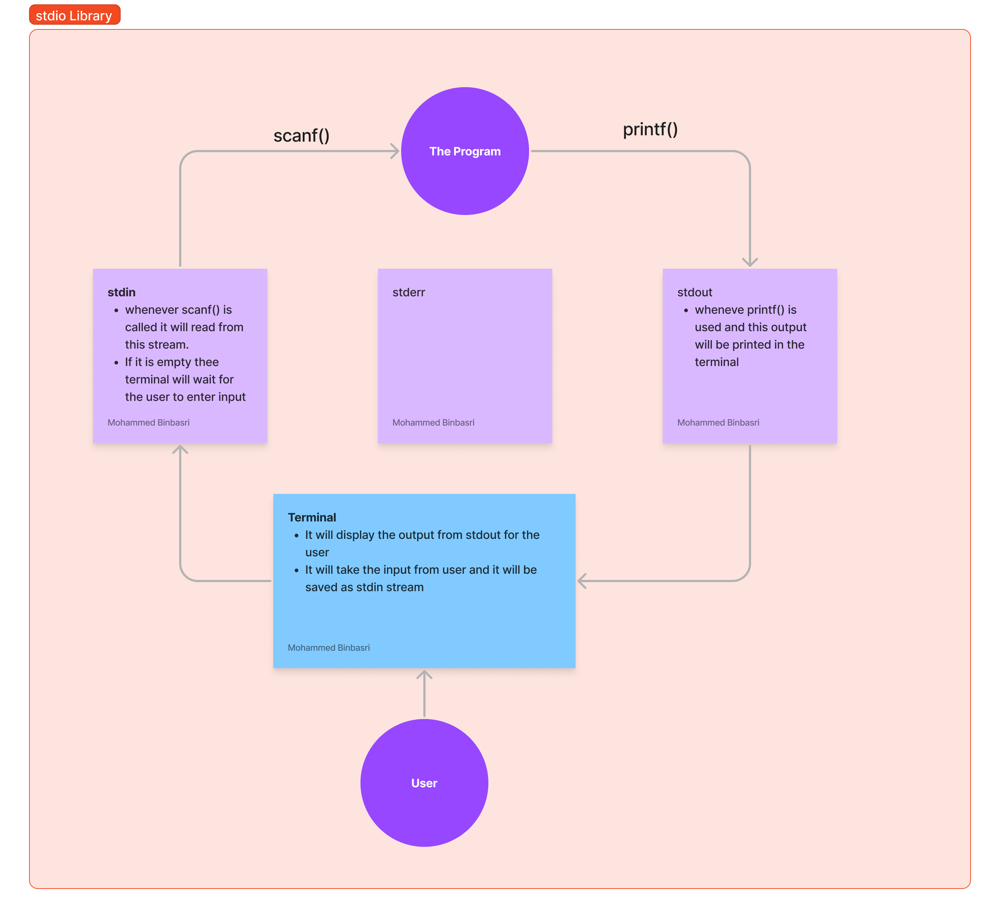
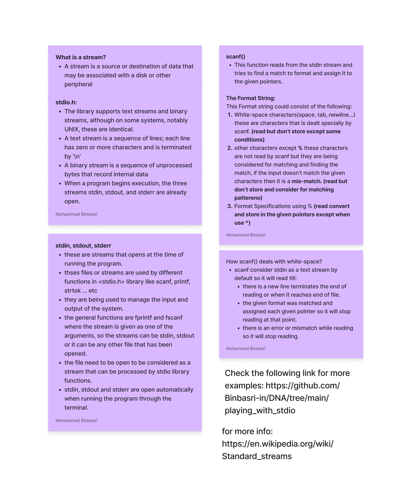

## This is a tutorial that explain some of the hidden info about stdio.h

The main thing is to understand the following components of a System I/O and how they work together.

- stdin (standard input)
- stdout (standard output)
- stderr (standard error)

#### This is part of understanding Operating Systems and how I/O works. that means these things are provided by the system and the programmer can use them to communicate with the system or with other programs.

### stdin

The standard input is a stream of data that is read by the program. It is usually the keyboard, but it can be redirected to a file or a pipe.

### stdout

The standard output is a stream of data that is written by the program. It is usually the screen, but it can be redirected to a file or a pipe.

### stderr

The standard error is a stream of data that is written by the program. It is usually the screen, but it can be redirected to a file or a pipe.

### The following is a try to visualize it:

